    

<h1 align="center"> 
 
 
 
</h1>

- 🔭 I worked as an **Intern** at **Invisibl Cloud** as a **Platform Engineer**
- 🎓 I'm in my graduation, pursuing **Integrated Master's** in **Information Technology**
- 📚 Read my blogs 👉🏼  
- ⚡ Know me more 👉🏼  
- 📫 Reach me through 👉🏼   
- 📝 Hire me by 👉🏼  
- ✌🏼️ Connect with me on   

  
<h2>📊 GitHub Metrics</h2>

  

    
  

  <h3>📅 Isometric Commit Calendar</h3>
  

    
  

  <h3>🈷️ Languages</h3>
  

    
    
  

  <h3>🏆 Achievements &nbsp;&nbsp;·&nbsp;&nbsp; 🎩 Notable Contributions</h3>
  

    
    
  

> These are generated automatically every day by <a href="https://github.com/lowlighter/metrics">lowlighter/metrics</a> via the <code>.github/workflows/metrics.yml</code> workflow in this repo — they'll appear once the workflow has run at least once.

  
<h2>🔥 Streak &amp; Legacy Stats</h2>

  <h3>🔥 Streak Stats</h3>
  

    
  

   

  <h3>💻 GitHub Profile Stats</h3>
  

 

 

  <h3>🏆 GitHub Trophies</h3>
  

    
  

   

<b>Note:</b> Top languages is only a metric of the languages my public code consists of and doesn't reflect experience or skill level.

   

  <h3>⚡ GitHub Graph Activity</h3>
  

  
<h2>📕 Projects I've Contributed To</h2>

<a href="https://github.com/sanjith-s/farmback"> 
<a href="https://github.com/sanjith-s/farmenience"> 

<a href="https://github.com/Sigma-Blue/ASP-Client"> 
<a href="https://github.com/Sigma-Blue/ASP-Server"> 

  
<h2>🛠️ My Favorite Tools</h2>

  <h3>👨‍💻 Programming and Markup Languages</h3>
  

  <h3>🧰 Databases and Technologies</h3>
  

  <h3>💻 Software and Tools</h3>
  

   
  

  
<h2>🎧 My Spotify Playing</h2>

  

  

