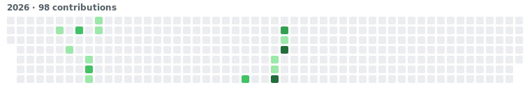
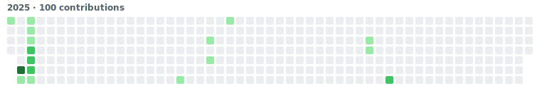
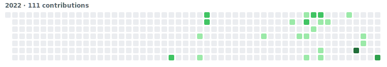

  
  

  
  
  
  
  
  

 

- 🔭 Two Platform Engineering internships at **Invisibl Cloud Solutions** — RAG search QA, a CAD-assistant PoC, and sole frontend ownership of a FinOps platform
- 🎓 Finishing an **Integrated M.Sc. IT** at CEG, Anna University (2021 – 2026), CGPA 8.28
- 🧠 Building with **RAG, LLM agents, FastAPI, and React** — recent work spans Haystack, OpenSearch, Claude, and Gemini
- ✍️ Writes regularly on [Medium](https://medium.com/@mettasurendhar) about observability, GenAI, and the realities of hackathons and job-hunting
- 📄 [Résumé](https://drive.google.com/file/d/1xWSyFlbvE_NHIMo3SOlLsad-CuEEFv2T/view) · 📫 [msurendhar8815@gmail.com](mailto:msurendhar8815@gmail.com)

 

## 📊 GitHub Metrics

> Auto-generated daily by [lowlighter/metrics](https://github.com/lowlighter/metrics) via `.github/workflows/metrics.yml`. First render appears after the workflow's initial run.

 

## 📅 Contribution Calendars

Click a year to expand it — each is rendered from GitHub's own contribution data for that exact Jan–Dec range (a custom script, since year-pinned ranges aren't something the isometric plugin below supports).

<b>2026</b>

<b>2025</b>

<b>2024</b>

<b>2023</b>

<b>2022</b>

Isometric view — rolling last 12 months

 

## 🈷️ Languages, Achievements &amp; Habits

<table>
<tr>
<td width="50%" valign="top"></td>
<td width="50%" valign="top"></td>
</tr>
<tr>
<td width="50%" valign="top"></td>
<td width="50%" valign="top"></td>
</tr>
</table>

Achievements and habits rely on GitHub-side scraping that occasionally breaks upstream (tracked in <a href="https://github.com/lowlighter/metrics/issues/1479">lowlighter/metrics#1479</a>) — if one shows blank after a run, re-running the workflow usually fixes it.

 

## 🔥 Streak &amp; Legacy Stats

  
  

  

 

## 💼 Experience

**Platform Engineer Intern** · Invisibl Cloud Solutions · _Jan – Jun 2026_
AI Applications, Testing &amp; Frontend Engineering

- QA-tested a RAG-based search platform across direct, tag-filtered, and file-selected query modes
- Built a PoC CAD Assistant rendering STEP files in a 3D viewer with LLM-driven conversational querying — the demo convinced the client to proceed
- Built region-aware frontend modules for a multi-region AWS Connect portal
- Sole frontend engineer on a FinOps cost platform (React, Vite, TypeScript, Tailwind, Zustand, TanStack, Apexcharts)

**Platform Engineering Intern** · Invisibl Cloud Solutions · _Jul – Dec 2024_
Observability Infrastructure &amp; Research Agent (LLM + RAG)

- Built a PoC log-observability stack (Cribl, rsyslog, Prometheus, Grafana, Loki) with dashboards and alerting
- Shipped a GenAI research agent (Haystack, Streamlit, AWS Bedrock, Gemini Flash), then refactored into a production FastAPI + OpenSearch RAG service using Claude

Full timeline, including QA internship and campus leadership roles, is in the <a href="https://drive.google.com/file/d/1xWSyFlbvE_NHIMo3SOlLsad-CuEEFv2T/view">résumé</a>.

 

## 🚀 Featured Projects

<table>
<tr>
<td width="50%" valign="top">

**[Gen Write-Up Agent](https://github.com/MettaSurendhar/Gen-Write-Up-Agent)** · [Live App](https://gen-write-up-agent.streamlit.app)
AI assistant for personalized, on-style LinkedIn/Twitter posts — Haystack, Gemini Flash, in-memory RAG, category-specific prompts.
 
  

</td>
<td width="50%" valign="top">

**Infinsa** — Hackz'24 Finalist · [App](https://github.com/MettaSurendhar/Infinsa-App) · [Server](https://github.com/MettaSurendhar/Infinsa-App-server)
AI fintech app for elderly users — voice commands, scam awareness, senior-friendly UI, backend + LLM integration.
 
  

</td>
</tr>
<tr>
<td width="50%" valign="top">

**[Alumni Student Platform](https://github.com/MettaSurendhar/Met-Social-Media-API)** — Team of 5
Mobile app for alumni–student mentoring; led the team and owned the backend end-to-end.
 
   

</td>
<td width="50%" valign="top">

**[Spectra Bot](https://github.com/Blue-Folks/converstional-chatbot)** — Smart India Hackathon PoW
Conversational image-recognition chatbot combining YOLOv8/Detectron2 detection with GPT via LangChain.
 
  

</td>
</tr>
</table>

 

## 🏆 Leadership &amp; Hackathons

- **Head of Industry Relations**, Guindy Times: Mugavari — _Sep 2025 – Jan 2026_
- **Student Director of Industrial Relations**, Math Colloquium: Mathrix 2025 — secured 20+ sponsorships from 100+ companies, co-organized a GenAI/RAG bootcamp with GDG and Azure Developer Community TN
- **General Secretary**, Student Association &amp; Art Society (SAAS) CEG — represented 4,000+ students, co-led two major fests, felicitated by the Dean
- **Team Lead, Hackz'24** — Fintech track finalist among 1,000+ teams (only CEG team to reach finals)
- **Team Lead, Smart India Hackathon** — selected 1 of 10 teams from 500+ at college level

 

## ✍️ Recent Writing

<table>
<tr>
<td width="33%" valign="top"> <a href="https://medium.com/@mettasurendhar/ai-agents-arent-ready-for-it-operations-yet-and-now-there-s-a-benchmark-that-proves-it-8e62a230e2d3"><b>AI Agents Aren't Ready for IT Operations Yet</b></a> Jul 2026</td>
<td width="33%" valign="top"> <a href="https://medium.com/@mettasurendhar/tired-of-writing-the-same-testcases-again-and-again-let-keploy-generate-them-8ead86367b0e"><b>Let Keploy Generate Your Testcases</b></a> Jan 2026</td>
<td width="33%" valign="top"> <a href="https://medium.com/@mettasurendhar/final-year-no-guarantee-what-its-really-like-looking-for-a-job-a19ded0234e4"><b>Final Year, No Guarantee</b></a> Jan 2026</td>
</tr>
</table>

<a href="https://medium.com/@mettasurendhar">More on Medium →</a>

 

## 🔗 Connect

  
  
  
  
  
  

  

